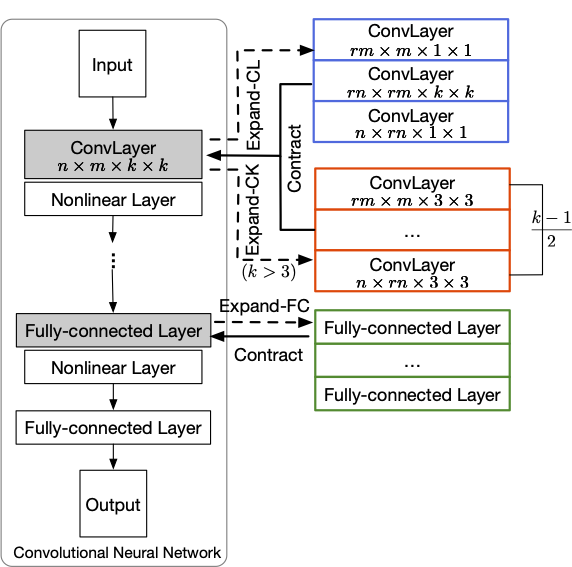

This repository is the official PyTorch implementation of training & evaluation code for [ExpandNets: Linear Over-parameterization to Train Compact Convolutional Networks](https://proceedings.neurips.cc/paper/2020/hash/0e1ebad68af7f0ae4830b7ac92bc3c6f-Abstract.html), NeurIPS 2020

# ExpandNets: Linear Over-parameterization to Train Compact Convolutional Networks

> Code is in early release and may be subject to change. Please feel free to open an issue in case of questions.

## Overview

<!--  -->
<div align="center">
  
</div>
<p align="justify">
  Figure 1: <b> ExpandNets</b>. We propose 3 strategies to linearly expand a compact network.
	An expanded network can then be contracted back to the compact one algebraically, and outperforms training the compact one, even with knowledge distillation.
</p>


## Image Classification
Here are code for image classification experiments on CIFAR-10, CIFAR-100 and ImageNet.

Details on each experiment are listed in corresponding README.md in each folder.


## Dummy test

We provide some toy code to expand a convolutional layer with either standard or 
depthwise convolutions and contract the expanded layers back.


Code in dummy_test.py is same as it in our supplementary material, which can be run simply. 

```bash
python dummy_test.py
 ```

## Citation
```
@inproceedings{NEURIPS2020_expandnets,
               author = {Guo, Shuxuan and Alvarez, Jose M. and Salzmann, Mathieu},
               booktitle = {Advances in Neural Information Processing Systems},
               editor = {H. Larochelle and M. Ranzato and R. Hadsell and M. F. Balcan and H. Lin},
               pages = {1298--1310},
               publisher = {Curran Associates, Inc.},
               title = {ExpandNets: Linear Over-parameterization to Train Compact Convolutional Networks},
               url = {https://proceedings.neurips.cc/paper/2020/file/0e1ebad68af7f0ae4830b7ac92bc3c6f-Paper.pdf},
               volume = {33},
               year = {2020}
}
```


