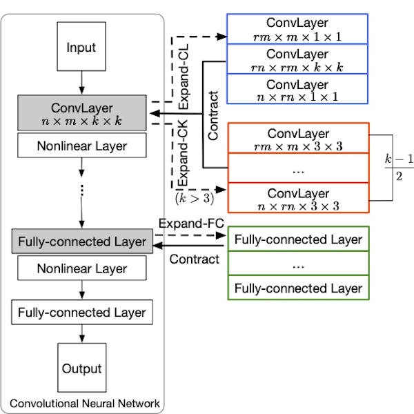

# Codes for ExpandNets

> Code is in early release and may be subject to change. Please feel free to open an issue in case of questions.


The code helps to get results 
Here are codes for image classification experiments of CIFAR-10, CIFAR-100 and ImageNet.
As for object detection and semantic segmentation, codes are available upon request.


Details on each experiment are listed in corresponding README.md in each folder.


## Dummy test

Here, we provide some toy code to expand a convolutional layer with either standard or 
depthwise convolutions and contract the expanded layers back.


Code in dummy_test.py is same as it in our supplementary material, which can be run simply. 

```bash
python dummy_test.py
 ```


